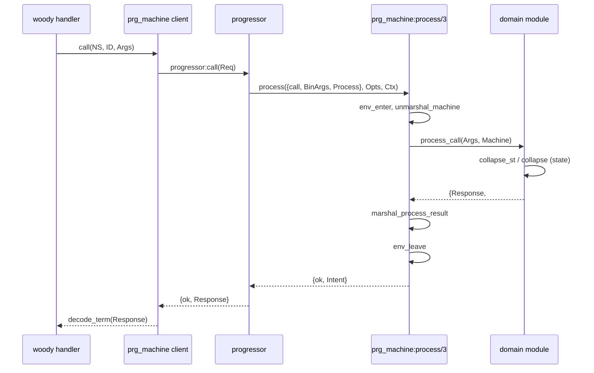

# Миграция на `prg_machine`: контекст для следующих доработок

Документ фиксирует **цель**, **целевую архитектуру**, **фактическое состояние** ветки `add_prg_layer` (hellgate) и **открытые хвосты**. Merge target: `epic/monorepo`.

Оркестрация Ralph: `/Users/artemfedorenko/Documents/paymentsols/ralph-2` (goal в `.ralph/goal.md`, задачи 1–36 verified, **37 — CT — не завершена**).

---

## 1. Цель и направление

**Единый runtime** для всех progressor namespace в Hellgate и Fistful:

```
woody handler (hg_*_handler, ff_*_handler)
    → prg_machine:start | call | get | repair | notify | remove | trace
        → progressor (storage + worker pool)
            → prg_machine:process/3
                → domain module (-behaviour(prg_machine))
```

**Убрать из prod path:**

| Было | Статус |
|------|--------|
| `hg_machine` + `hg_progressor_handler` | **удалены** |
| `ff_machine` + `fistful` как machinery processor | **удалены** |
| `*_machinery_schema` в `ff_server` | **удалены** |
| `machinery_prg_backend` в `config/sys.config` для prod NS | **убран** |
| `hg_machine_action` | **удалён** → `prg_machine_action` |

**Не в scope этой миграции (отдельные goals):**

- Trace API на Thrift (`docs/trace-api-thrift.md`)
- ~~Hybrid MG↔progressor (`hg_hybrid`, machinegun)~~ — **удалено**
- Полное удаление зависимости `machinery` из `rebar.config`
- Дедупликация HG/FF утилит (`operation_context`, `ff_core`) — другой Ralph goal

**Принципы:**

- Один путь данных, без dual-write и адаптеров «старый API → новый» в проде
- Доменные границы HG/FF сохраняются; общее — только в `apps/prg_machine`
- `hg_proto` / Thrift encode **не** тащить в `prg_machine` (тонкий `hg_invoicing_machine_client` в hellgate)

---

## 2. Как должно работать: `prg_machine`

### 2.1. OTP app `apps/prg_machine`

| Модуль | Роль |
|--------|------|
| `prg_machine` | behaviour, client API, `process/3`, `collapse`/`emit_events` |
| `prg_machine_registry` | gen_server — владелец ETS `prg_machine_dispatch`, `lookup/1` → `{unknown_namespace, NS}` |
| `prg_machine_action` | таймеры / remove → формат progressor |

**Registry:** `prg_machine:get_child_spec([Module, …])` поднимает `prg_machine_registry`; при старте в ETS кладётся `{Namespace, HandlerModule}` по `Handler:namespace/0`. При рестарте реестра таблица пересоздаётся из того же списка handlers.

**Client API** (`start`, `call`, `get`, `repair`, `notify`, `remove`, `trace`) — обёртки над `progressor:*` с encode/decode term и woody/otel context.

**`process/3`** — callback progressor:

1. `env_enter(WoodyCtx)` — поднять `operation_context` (HG или FF binding)
2. `unmarshal_machine` — history + aux_state из storage
3. `dispatch` → `Handler:init | process_call | process_signal | process_repair | process_notification`
4. `marshal_process_result` — events, action, aux_state (только при явном `auxst` от домена) обратно в progressor
5. `env_leave()` в `after`

При необработанном исключении в домене: `{error, {exception, Class, Reason, Stacktrace}}` + structured log (`stacktrace`, `exception` в metadata).

**Контекст RPC:** `application:set_env(prg_machine, woody_context_loader, Loader)` в `hellgate:start/2` и `ff_server:start/2` (fun или `{M,F}`), fallback на `woody_context:new()`.

### 2.2. Behaviour (доменный модуль)

Обязательные callbacks:

- `namespace/0`, `init/2`, `process_signal/2`, `process_call/2`, `process_repair/2`
- `marshal_event_body/1`, `unmarshal_event_body/2`, `marshal_aux_state/1`, `unmarshal_aux_state/1`

Опционально: `process_notification/2`.

**Результат домена** (`result()`):

```erlang
#{
    events => [EventBody, ...],
    action => prg_machine_action:t(),  % таймер / remove / undefined
    auxst => term()                    % обычно #{ctx => ...} для FF, #{} для HG
}
```

**Actions:** `prg_machine_action` заменяет `hg_machine_action` и FF `continue`/`sleep`/`unset_timer`. Маппинг в progressor — `prg_machine_action:to_progressor/1`.

### 2.3. Event-sourcing helpers

| Функция | Назначение |
|---------|------------|
| `collapse/2` | fold по history: `apply_event/4` (EventID, Ts, Body, Model) если экспортирован, иначе `apply_event/2` (FF) |
| `emit_event/1`, `emit_events/1` | обёртка с timestamp для новых событий |
| `initial_model/2` | старт fold: `maps:get(model, AuxState, undefined)` при `is_map(AuxState)`, иначе `undefined` |

**FF:** домены вызывают `prg_machine:collapse(Mod, Machine)` в `*_machine` и внутри домена.

**HG invoice (хвост):** пока `collapse_st/1` / `collapse_history/1`; целевой паттерн — `prg_machine:collapse` + `apply_event/4` (см. `.ralph/goal-hg-collapse.md` в ralph-2).

### 2.4. Конфиг progressor (`config/sys.config`)

Единый шаблон для каждого NS (prod — 7 namespace: 2× HG + 5× FF):

```erlang
processor => #{
    client => prg_machine,
    options => #{
        ns => <namespace_atom>,
        %% HG (strict) / FF (lenient) — см. operation_context:hellgate_binding/0, fistful_binding/0
        context_binding => #{
            registry_key => {p, l, stored_hg_context},
            cleanup_mode => strict
        }
    }
}
```

`prg_machine:process/3` поднимает RPC-контекст через `operation_context:env_enter/2` и снимает через `operation_context:env_leave/1` по `context_binding`, если в `options` не заданы явные хуки `env_enter` / `env_leave`.

**Приоритет резолва** (`resolve_env_enter/1`, `resolve_env_leave/1` в `prg_machine.erl`):

1. Явный fun в `env_enter` / `env_leave` — перекрывает всё (CT с кастомным `party_client` и т.п.)
2. `context_binding => Binding` — `operation_context:env_enter(WoodyCtx, Binding)` / `env_leave(Binding)`
3. noop — `fun(_) -> ok end` / `fun() -> ok end`, если ни fun, ни binding не заданы

Стандартный enter: `woody_context` + `party_client:create_client()` в gproc по `registry_key` из binding.

Без `handler`, `schema`, `machinery_prg_backend`.

### 2.5. Тонкие обёртки

| Слой | Паттерн |
|------|---------|
| `*_machine.erl` | только `prg_machine:*` client API |
| `ff_*_handler.erl` | woody → `*_machine` / домен, без `machinery:` |
| `hg_invoicing_machine_client` | Thrift RPC к invoice machines через `prg_machine:call/6` + `hg_proto_utils` |

---

## 3. Что сделано (этапы P0–P5)

| Этап | Состояние | Содержание |
|------|-----------|------------|
| **P0** | ✅ | `prg_machine` в `rebar.config` + `{applications}`; `woody_context_loader`; `rebar3 compile` |
| **P1** | ✅ | `ff/deposit_v1` end-to-end |
| **P2** | ✅ | 5 FF NS: deposit, source, destination, withdrawal, session |
| **P2b** | ⏸ вырезано | `ff/identity`, `ff/wallet_v2` — NS убраны из config (модулей в репо не было) |
| **P3** | ✅ | `invoice` на `prg_machine` |
| **P4** | ✅ частично | `invoice_template` на `prg_machine`; `customer`, `recurrent_paytools` — NS убраны из config |
| **P5** | ✅ частично | удалены `hg_machine`, `ff_machine`, `fistful.erl`, processor glue; **не** полный grep-gate по всему репо |

### 3.1. Prod namespaces на `prg_machine` (7 шт.)

| NS | Домен | Registry child spec |
|----|-------|---------------------|
| `invoice` | `hg_invoice` | `hellgate.erl` |
| `invoice_template` | `hg_invoice_template` | `hellgate.erl` |
| `ff/deposit_v1` | `ff_deposit` | `ff_server.erl` |
| `ff/source_v1` | `ff_source` | `ff_server.erl` |
| `ff/destination_v2` | `ff_destination` | `ff_server.erl` |
| `ff/withdrawal_v2` | `ff_withdrawal` | `ff_server.erl` |
| `ff/withdrawal/session_v2` | `ff_withdrawal_session` | `ff_server.erl` |

### 3.2. Удалённые / ключевые изменения

**Удалено:**

- `apps/hellgate/src/hg_machine.erl`, `hg_machine_action.erl`
- `apps/fistful/src/ff_machine.erl`, `fistful.erl`
- `apps/hg_progressor/` (`hg_progressor_handler`, `hg_hybrid`, `call_automaton` glue)
- `apps/ff_server/src/ff_*_machinery_schema.erl` (×5)

**Добавлено:**

- `apps/prg_machine/` (`prg_machine.erl`, `prg_machine_action.erl`)
- `apps/ff_transfer/src/ff_machine_codec.erl` — marshal/unmarshal aux и общий codec
- `apps/hellgate/src/hg_invoicing_machine_client.erl`

**Переписано:**

- FF домены: `-behaviour(prg_machine)` (`ff_deposit`, `ff_source`, `ff_destination`, `ff_withdrawal`, `ff_withdrawal_session`)
- HG: `hg_invoice`, `hg_invoice_template` — behaviour + `prg_machine` client
- `ff_repair` — на `prg_machine:collapse` / `emit_events`
- `ff_machine_handler` — trace через `progressor:trace/1` (JSON HTTP; Thrift — отдельный goal, `docs/trace-api-thrift.md`)
- CT helper: `hg_ct_helper.erl` — progressor processor `client => prg_machine`

### 3.3. Ralph verification

- Задачи **1–34, 36** — verified
- Задача **37** (полный CT) — **не завершена** (прерывание ~37 мин, resource_exhausted)
- Integration gate: `rebar3 compile` OK, CT deferred
- Ветка: `add_prg_layer` → merge в `epic/monorepo`; PR ещё не открыт
- Runtime fixes (этапы 1, 3 review-plan): aux_state, registry, stacktrace — **в коде**

---

## 4. Диаграмма потока (call)



---

## 5. Известные хвосты (следующие доработки)

### 5.1. Блокеры перед merge

| # | Хвост | Действие |
|---|-------|----------|
| 1 | **CT не прогонялись** | Запустить suites вручную (docker: postgres, party, dmt) |
| 2 | **Нет PR** | PR `add_prg_layer → epic/monorepo` после зелёного CT |

**CT suites (минимум):**

```bash
cd /Users/artemfedorenko/Documents/work/hellgate
rebar3 ct --suite apps/ff_server/test/ff_deposit_handler_SUITE
rebar3 ct --suite apps/ff_server/test/ff_withdrawal_handler_SUITE
rebar3 ct --suite apps/ff_server/test/ff_withdrawal_session_repair_SUITE
rebar3 ct --suite apps/hellgate/test/hg_invoice_lite_tests_SUITE
rebar3 ct --suite apps/hellgate/test/hg_invoice_tests_SUITE
rebar3 ct --suite apps/hellgate/test/hg_invoice_template_tests_SUITE
rebar3 ct --suite apps/hellgate/test/hg_direct_recurrent_tests_SUITE
```

### 5.2. Legacy machinery (вне prod NS, но в репо)

| Модуль / config | Статус |
|-----------------|--------|
| `test/bender/sys.config`, `test/party-management/sys.config` | **намеренно** `machinery_prg_backend` — docker-sidecar сервисы bender / party-management (вне scope HG/FF) |
| `apps/ff_cth/src/ct_payment_system.erl` | **очищено** — убран мёртвый `{machinery_backend, progressor}` |
| `apps/machinery_extra/` | **удалён** — codec-слой в `ff_core` (`ff_msgpack`, `ff_machine_schema`) |
| `rebar.config` damsel pin | ждёт `progressor_trace.thrift` в damsel — см. `docs/trace-api-thrift.md` |

### 5.3. Trace API

- Сейчас: FF internal HTTP JSON (`ff_machine_handler` → `progressor:trace/1`)
- Цель (отдельно): Thrift по `progressor_trace.thrift`, см. `docs/trace-api-thrift.md`
- В git status были черновики `hg_progressor_trace*` — **не** в финальном дереве (app `hg_progressor` удалён)

### 5.4. P2b — orphan NS

`ff/identity`, `ff/wallet_v2`, HG `customer`, `recurrent_paytools` — убраны из `sys.config`. Если понадобятся в проде — отдельный PR с доменными модулями + `prg_machine`.

### 5.5. Технический долг в runtime

- ~~`marshal_intent` портит aux_state при отсутствии `auxst`~~ — **исправлено** (этап 1)
- ~~`initial_model/2` badmap на не-map aux_state~~ — **исправлено** (этап 1)
- ~~registry на пустом supervisor, `ets:lookup_element` badarg~~ — **исправлено** (`prg_machine_registry`, этап 3)
- ~~stacktrace теряется в `process/3`~~ — **исправлено** (4-tuple + log metadata, этап 3)
- ~~`binary_to_term` без `[safe]`~~ — **закрыто**
- `hg_invoice` двойной collapse — отложено (см. `prg-machine-remaining-debt.md` §5)
- ~~L1: разные timestamp в `marshal_event_body`~~ — **закрыто** (единый `{prg_machine:timestamp(), 0}`)

### 5.6. Grep-инварианты (целевые после полного P5)

```bash
rg 'hg_machine:' apps/hellgate --glob '*.erl'                             # 0 prod
rg 'machinery_prg_backend|ff_machine:' apps/fistful apps/ff_transfer apps/ff_server --glob '*.erl'  # 0
rg "client => machinery_prg_backend" config/sys.config                     # 0
```

---

## 6. Чеклист для нового домена / NS

1. `config/sys.config` — `processor => #{client => prg_machine, options => #{ns => ..., env_enter, env_leave}}`
2. Доменный модуль: `-behaviour(prg_machine)` + callbacks
3. `apply_event/2` (FF) или `apply_event/4` (HG: event_id + timestamp + body) для `prg_machine:collapse/2`
4. Codec событий в `marshal_event_body` / `unmarshal_event_body` (или `ff_machine_codec`)
5. `*_machine.erl` — только `prg_machine:*`
6. Woody handler — без `machinery` / `hg_machine`
7. Добавить модуль в `get_child_spec([...])` в `hellgate.erl` или `ff_server.erl`
8. CT suite для NS
9. `rebar3 compile` + grep gate

---

## 7. Связанные файлы (точки входа)

| Путь | Зачем смотреть |
|------|----------------|
| `apps/prg_machine/src/prg_machine.erl` | behaviour, process/3, collapse |
| `apps/prg_machine/src/prg_machine_registry.erl` | ETS registry owner |
| `docs/prg-machine-review-plan.md` | поэтапный план ревью и доработок |
| `apps/prg_machine/src/prg_machine_action.erl` | таймеры |
| `config/sys.config` | все prod NS |
| `apps/hellgate/src/hellgate.erl` | HG registry |
| `apps/ff_server/src/ff_server.erl` | FF registry + woody |
| `apps/hellgate/src/hg_invoice.erl` | образец HG behaviour |
| `apps/ff_transfer/src/ff_deposit.erl` | образец FF behaviour + collapse |
| `apps/hellgate/src/hg_invoicing_machine_client.erl` | Thrift → prg_machine |
| `apps/fistful/src/ff_repair.erl` | repair + collapse |
| `docs/trace-api-thrift.md` | следующий этап trace |
| `docs/prg-machine-error-semantics-hg-ff.md` | семантика ошибок, HG vs FF, CT-регрессии, meck |

---

## 8. История Ralph (кратко)

- **Goal:** `.ralph/goal.md` в ralph-2
- **Completed:** tasks 1–36 (infra, FF×5, HG invoice+template, cleanup, CT helper fix)
- **Open:** task 37 — full CT; review round 1 не закрыт (`review_phase_completed: false`)
- **Устаревший артефакт:** `.ralph/summary.md` в ralph-2 — обновлён ссылкой на этот документ

*Дата отчёта: 2026-06-07*
