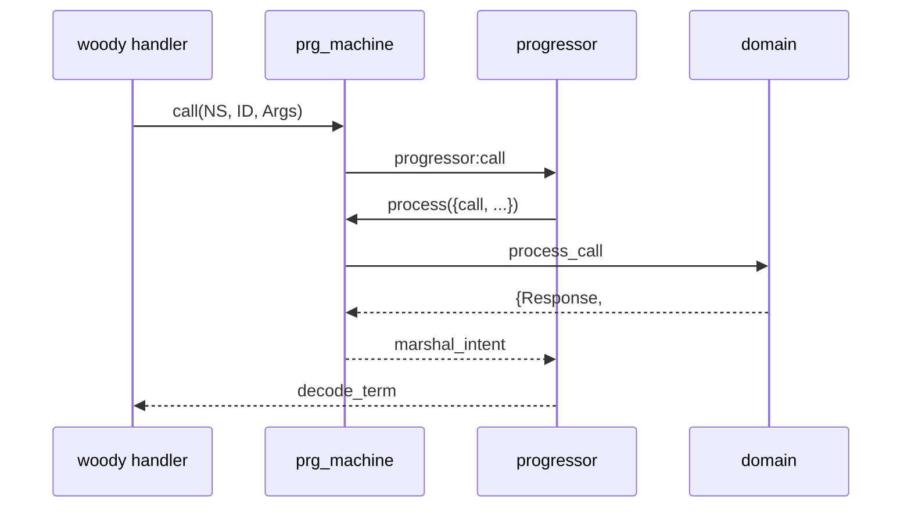

# `prg_machine` в Hellgate / Fistful

Единый runtime поверх progressor для HG и FF. Контракт `action()` в progressor: `progressor/docs/step-effect-migration.md`.

*Обновлено: 2026-06-12. CI (compile, dialyzer, CT + compose) — green локально.*

---

## 1. Поток данных

```
woody handler (hg_*_handler, ff_*_handler)
  → prg_machine:start | call | get | repair | notify | remove | trace
    → progressor
      → prg_machine:process/3
        → domain module (-behaviour(prg_machine))
```



**Убрано из prod:** `hg_machine`, `ff_machine`, `hg_progressor_handler`, `machinery_prg_backend` в `config/sys.config`, `progressor_action`, legacy map в intent.

**Вне scope:** Trace на Thrift → `docs/trace-api-thrift.md`. `{machinery, …}` в `rebar.config` — только docker-sidecar тесты (`test/bender`, `test/party-management`).

---

## 2. Модули `apps/prg_machine`

| Модуль | Роль |
|--------|------|
| `prg_machine` | behaviour, client API, `process/3`, `collapse` / `emit_events` |
| `prg_machine_registry` | ETS `{Namespace, Handler}`; `{unknown_namespace, NS}` |
| `prg_action` | `{timeout, Sec}` / `{deadline, Dt}` → wire `action()` |

**`process/3`:** `env_enter` → `unmarshal_machine` → `dispatch` → `marshal_process_result` → `env_leave`. Исключение в домене → `{error, {exception, Class, Reason, Stacktrace}}` + log.

**Контекст RPC:** `woody_context_loader` в `hellgate` / `ff_server`; иначе `operation_context` по `context_binding` из `sys.config` (HG strict / FF lenient).

---

## 3. Контракт домена

### Callbacks

`namespace/0`, `init/2`, `process_signal/2`, `process_call/2`, `process_repair/2`, marshal/unmarshal event + aux_state. Опционально: `process_notification/2`.

### `result()`

```erlang
#{
    events => [EventBody, ...],
    action => action(),   %% progressor.hrl; omit = idle
    auxst => term()       %% ключ пишется только при явном обновлении
}
```

### Wire `action()`

```erlang
idle | suspend | timeout | remove
| {schedule, #{at := UnixSec, action := timeout | remove}}
```

| Было (legacy) | Стало |
|---------------|-------|
| `instant()` / `set_timeout(0, _)` | `timeout` |
| `unset_timer` | `suspend` |
| `remove()` | `remove` |
| `set_timeout(N, _)` / deadline | `prg_action:schedule_timer/1`, `schedule_deadline/1` |

`prg_action` — **не** адаптер MG/repair, только timer tuple → `{schedule, ...}`.

FF доменный `continue` / `sleep` / `{setup_timer, T}` → wire через `map_action/1` в каждом модуле.

### Prod namespaces (7)

| NS | Модуль | Registry |
|----|--------|----------|
| `invoice` | `hg_invoice` | `hellgate.erl` |
| `invoice_template` | `hg_invoice_template` | `hellgate.erl` |
| `ff/deposit_v1` | `ff_deposit` | `ff_server.erl` |
| `ff/source_v1` | `ff_source` | `ff_server.erl` |
| `ff/destination_v2` | `ff_destination` | `ff_server.erl` |
| `ff/withdrawal_v2` | `ff_withdrawal` | `ff_server.erl` |
| `ff/withdrawal/session_v2` | `ff_withdrawal_session` | `ff_server.erl` |

Orphan NS (`ff/identity`, `ff/wallet_v2`, HG `customer`, `recurrent_paytools`) убраны из config.

### `sys.config` (шаблон)

```erlang
processor => #{
    client => prg_machine,
    options => #{
        ns => <atom>,
        context_binding => #{registry_key => ..., cleanup_mode => strict | lenient}
    }
}
```

---

## 4. Ошибки: три слоя

| Слой | Пример | Где |
|------|--------|-----|
| **A** Progressor API | `{error, <<"process is waiting">>}` | `prg_machine:call` |
| **B** Processor response | `{ok, {error, invalid_callback}}` | домен в теле ответа |
| **C** Woody throw | `#payproc_InvoiceNotFound{}` | handler |

Путаница A vs B — типичный источник регрессий после миграции с machinery.

### `prg_machine` client API (целевой контракт)

| Progressor | `call` / `start` |
|------------|------------------|
| `<<"process not found">>` / `<<"process is init">>` | `{error, notfound}` |
| `<<"process is error">>` | `{error, failed}` |
| `{exception, ...}` | **pass-through** `{error, {exception, ...}}` |
| прочие guard (`<<"process is waiting">>`, …) | **pass-through** `{error, Reason}` |
| `<<"process already exists">>` (`start`) | `{error, exists}` |

`repair`: + `{error, working}` для `<<"process is running">>`; остальное → `{error, {repair, {failed, Reason}}}` с сохранением `Reason`.

**Антипаттерн:** catch-all `{error, _} -> {error, failed}` — ломает HG CT (waiting/running превращаются в `failed`).

**Machinery (история):** guard-ошибки на call возвращались как `{ok, {error, Reason}}`. Полная эмуляция в `prg_machine` не нужна — достаточно pass-through + `{error, _} = Error -> Error` в `hg_invoicing_machine_client` и `ff_*_machine`.

**Слой B** обрабатывается в домене (`hg_invoice:process_callback` → `{error, failed}` для `{ok, {error,_}}`), не в `prg_machine`.

### FF CT: meck `prg_machine:process/3`

```erlang
meck:new(prg_machine, [no_link, passthrough]),
meck:expect(prg_machine, process, fun process/3).
%% внутри: 'prg_machine_meck_original':process(Call, Opts, BinCtx).
```

Processor crash в тестах: `{error, {exception, _, _}}`, не атом `failed`.

---

## 5. Техдолг

### До релиза

- Progressor: CHANGELOG + tag `vX.Y.0`
- Hellgate: bump tag в `rebar.config` (сейчас branch `add_action_module`, ref `4f6d78a`)

### Границы thrift / repair (не блокер)

Прикладной код не обязан повторять семантику progressor. Сейчас conversion корректна, но не «нативный wire на входе»:

| Место | Сейчас |
|-------|--------|
| `hg_invoice:action_to_prg/1`, `construct_repair_action/1` | inline `#mg_stateproc_ComplexAction{}` / `#repair_ComplexAction{}` → wire |
| `ff_codec` | unmarshal repair → `[set_timer \| remove]`, дальше `map_action/1` |

HG repair timer + remove: `remove` побеждает timer — осознанная прикладная семантика.

### HG invoice — двойной collapse

Реплей: `prg_machine:collapse` (lenient). После call: `validate_changes` → `collapse_changes` strict **мимо** `collapse/2`, плюс повтор в `to_prg_result`. Цель — один фолд через `prg_machine` с параметром strict/lenient (`apply_new_events/3` + убрать двойной проход в `process_call`). Только HG invoice; FF на `apply_event/2`.

### Прочее (низкий приоритет)

- Registry без ETS `heir` — краткое окно при рестарте
- Фиктивная обёртка `{ev, Ts, Body}` в event payload
- Trace: сейчас HTTP JSON (`ff_machine_trace`); Thrift — `docs/trace-api-thrift.md`

---

## 6. Новый namespace

1. `sys.config` — `client => prg_machine`
2. `-behaviour(prg_machine)` + callbacks
3. `apply_event/2` (FF) или `apply_event/4` (HG) для `collapse/2`
4. `*_machine.erl` — только `prg_machine:*`
5. Handler в `get_child_spec` (`hellgate.erl` / `ff_server.erl`)
6. CT suite

---

## 7. Grep-инварианты

```bash
rg 'progressor_action|hg_machine_action' apps/              # 0
rg '#{set_timer' apps/ --glob '*.erl'                        # 0
rg 'machinery_prg_backend|ff_machine:' apps/fistful apps/ff_transfer apps/ff_server --glob '*.erl'  # 0
rg "client => machinery_prg_backend" config/sys.config      # 0
```

---

## 8. Точки входа в коде

| Путь | Зачем |
|------|-------|
| `apps/prg_machine/src/prg_machine.erl` | behaviour, errors, marshal_intent |
| `apps/prg_machine/src/prg_action.erl` | timer → wire |
| `apps/hellgate/src/hg_invoice.erl` | HG behaviour, repair, `action_to_prg` |
| `apps/ff_transfer/src/ff_deposit.erl` | FF behaviour |
| `apps/hellgate/src/hg_invoicing_machine_client.erl` | Thrift → prg_machine |
| `apps/fistful/src/ff_repair.erl` | repair scenarios |
| `apps/ff_server/src/ff_codec.erl` | repair thrift unmarshal |
| `apps/ff_transfer/test/ff_ct_machine.erl` | meck hooks |
