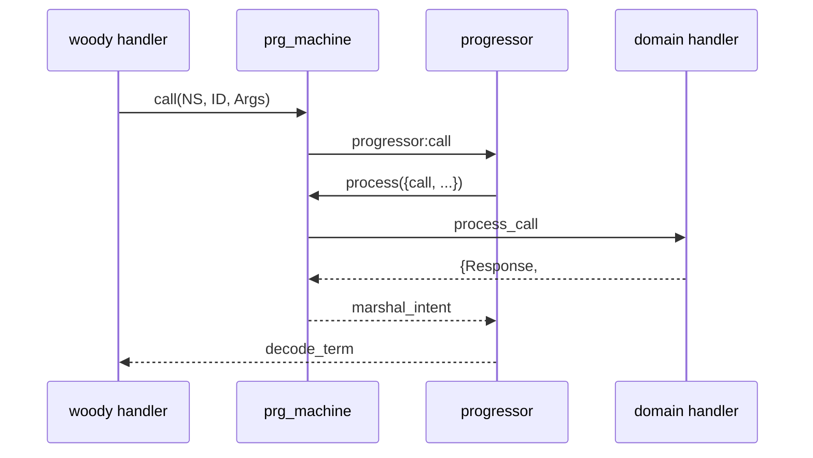

# `prg_machine` в Hellgate / Fistful

Единый runtime поверх progressor для HG и FF. Контракт `action()` в progressor: `progressor/docs/step-effect-migration.md`.

Бэклог упрощений после миграции: [refactor-local.md](refactor-local.md) (понятные задачи), [refactor-architecture.md](refactor-architecture.md) (крупные итерации).

*Обновлено: 2026-06-17.*

---

## 1. Поток данных

```
woody handler (hg_*_handler, ff_*_handler)
  → prg_machine:start | call | get | repair | notify | remove
    → progressor
      → prg_machine:process/3
        → domain handler (-behaviour(prg_machine))
```



**Убрано из prod:** `hg_machine`, `ff_machine`, `hg_progressor_handler`, `machinery_prg_backend` в `config/sys.config`, `progressor_action`, legacy map в intent, отдельные модули `prg_machine_client` / `prg_machine_processor` / `prg_machine_events` / `prg_machine_env` / `prg_machine_codec` (логика сведена в `prg_machine.erl`).

**Trace (FF only):** HTTP JSON через `ff_machine_handler` → `ff_machine_trace` (не client API `prg_machine`). Thrift — `docs/trace-api-thrift.md`.

**Вне scope:** `{machinery, …}` в `rebar.config` — только docker-sidecar тесты (`test/bender`, `test/party-management`).

---

## 2. Модули `apps/prg_machine`

| Модуль | Роль |
|--------|------|
| `prg_machine` | behaviour, client API (`start` / `call` / `get` / `repair` / `notify` / `remove`), `process/3`, `collapse` / `emit_events`, term codec, event marshal, env scoping |
| `prg_machine_registry` | ETS `{Namespace, Handler}`; owner-процесс + `get_child_spec/1` |
| `prg_action` | `{timeout, Sec}` / `{deadline, Dt}` → wire `action()`; scheduling helpers |
| `ff_machine_lib` | общие FF-хелперы: create/get/repair/history, `to_prg_result`, event/aux_state codec |

Связанные модули вне приложения: `op_context` (woody/party context, `env_enter` / `env_leave`, `current_woody_context/0`), `ff_machine_codec` (FF event/aux_state marshal, legacy sniff).

### `process/3`

```
registry lookup
  → decode_rpc_context + attach otel
  → ensure_deadline_set (default 30s, `default_handling_timeout` в opts)
  → run_scoped: op_context:env_enter / env_leave (если `context_binding` в opts)
  → unmarshal_machine
  → dispatch (init | call | repair | notify | timeout)
  → marshal_process_result
```

- Неизвестный namespace → `{error, {unknown_namespace, NS}}`.
- Исключение в домене → `{error, {exception, Class, Reason}}` + log (stacktrace только в логах).
- `env_leave` в `after`, ошибки leave логируются, не маскируют результат dispatch.

**Контекст RPC:** `op_context:current_woody_context/0` — hellgate-binding, затем fistful-binding, иначе fresh ctx + warning (заменяет старый `woody_context_loader` app-env hook). В `process/3` — `env_enter`/`env_leave` по `context_binding` из `sys.config` (HG strict / FF lenient).

**События:** timestamp пишется в progressor как microsecond integer; при чтении — machinery-формат `{calendar:datetime(), Micro}`. Metadata пишет оба ключа `<<"format_version">>` и `<<"format">>`. FF payload — legacy `term_to_binary({bin, ThriftBin})`; HG payload — `term_to_binary(msgpack)`.

**aux_state:** домен возвращает ключ `auxst`; в intent progressor пишется `aux_state` **только** при явном `auxst` в result map. Пропуск ключа сохраняет существующий aux_state в storage (важно после business-exception и noop notify).

---

## 3. Контракт домена

### Callbacks

`namespace/0`, `init/2`, `process_signal/2`, `process_call/2`, `process_repair/2`, marshal/unmarshal event + aux_state. Опционально: `process_notification/2`.

`collapse/2` вызывает только канонический `apply_event/4`:

```erlang
apply_event(EventID, Timestamp, EventBody, Model)
```

Legacy-формы fold'а адаптируются в доменном модуле. Runtime больше не выбирает между `apply_event/2` и `apply_event/4`.

### `result()`

```erlang
#{
    events => [EventBody, ...],
    action => action(),   %% progressor.hrl; omit = idle
    auxst => term()       %% ключ пишется только при явном обновлении
}
```

### Wire `action()`

```erlang
idle | suspend | timeout | remove
| {schedule, #{at := timestamp_us(), action := timeout | remove}}
```

| Было (legacy) | Стало |
|---------------|-------|
| `instant()` / `set_timeout(0, _)` | `timeout` |
| `unset_timer` | `suspend` |
| `remove()` | `remove` |
| `set_timeout(N, _)` / deadline | `prg_action:schedule_timer/1`, `schedule_deadline/1` |

`hg_invoice:construct_repair_action/1` — damsel `#repair_ComplexAction{}` → wire в HG repair. FF repairer `#repairer_ComplexAction{}` → wire в `ff_codec:unmarshal_repairer_complex_action/2`. `prg_action:marshal_timer/1` принимает `{deadline, {calendar:datetime(), Micro}}` (machinery-формат из `ff_codec:unmarshal(timer, ...)`).

FF домен возвращает `prg_action:t()` напрямую; `*_machine` оборачивает через `ff_machine_lib:to_prg_result/1`.

### Prod namespaces (7)

| NS | Handler (registry) | Доменная логика | Registry |
|----|--------------------|-----------------|----------|
| `invoice` | `hg_invoice` | `hg_invoice` | `hellgate.erl` |
| `invoice_template` | `hg_invoice_template` | `hg_invoice_template` | `hellgate.erl` |
| `ff/deposit_v1` | `ff_deposit_machine` | `ff_deposit` | `ff_server.erl` |
| `ff/source_v1` | `ff_source_machine` | `ff_source` | `ff_server.erl` |
| `ff/destination_v2` | `ff_destination_machine` | `ff_destination` | `ff_server.erl` |
| `ff/withdrawal_v2` | `ff_withdrawal_machine` | `ff_withdrawal` | `ff_server.erl` |
| `ff/withdrawal/session_v2` | `ff_withdrawal_session_machine` | `ff_withdrawal_session` | `ff_server.erl` |

HG регистрирует доменные модули напрямую. FF — тонкие `*_machine` (behaviour + codec + делегирование в домен).

Orphan NS (`ff/identity`, `ff/wallet_v2`, HG `customer`, `recurrent_paytools`) убраны из config.

### `sys.config` (шаблон)

```erlang
processor => #{
    client => prg_machine,
    options => #{
        ns => <atom>,
        context_binding => #{registry_key => ..., cleanup_mode => strict | lenient},
        default_handling_timeout => 30000   %% optional, woody deadline default
    }
}
```

---

## 4. Ошибки: три слоя

| Слой | Пример | Где |
|------|--------|-----|
| **A** Progressor API | `{error, <<"process is waiting">>}` | `prg_machine:call` |
| **B** Processor response | `{ok, {error, invalid_callback}}` | домен в теле ответа |
| **C** Woody throw | `#payproc_InvoiceNotFound{}` | handler |

Путаница A vs B — типичный источник регрессий после миграции с machinery.

### `prg_machine` client API (целевой контракт)

| Progressor | `call` / `start` |
|------------|------------------|
| `<<"process not found">>` / `<<"process is init">>` | `{error, notfound}` |
| `<<"process is error">>` | `{error, failed}` |
| `{exception, Class, Reason}` (3- или 4-tuple) | **pass-through** `{error, {exception, Class, Reason}}` (stacktrace срезается) |
| прочие guard (`<<"process is waiting">>`, …) | **pass-through** `{error, Reason}` |
| `<<"process already exists">>` (`start`) | `{error, exists}` |

`get`: + `{error, {unknown_namespace, NS}}` при отсутствии handler в registry.

`repair`: + `{error, working}` для `<<"process is running">>`; прочие term-reasons → `{error, {repair, {failed, Reason}}}`.

**Антипаттерн:** catch-all `{error, _} -> {error, failed}` — ломает HG CT (waiting/running превращаются в `failed`).

**Machinery (история):** guard-ошибки на call возвращались как `{ok, {error, Reason}}`. Полная эмуляция в `prg_machine` не нужна — достаточно pass-through + `{error, _} = Error -> Error` в `hg_invoicing_machine_client` и `ff_*_machine`.

**Слой B** обрабатывается в домене (`hg_invoice:process_callback` → `{error, failed}` для `{ok, {error,_}}`), не в `prg_machine`.

### FF CT: meck `prg_machine:process/3`

```erlang
meck:new(prg_machine, [no_link, passthrough]),
meck:expect(prg_machine, process, fun process/3).
%% внутри: 'prg_machine_meck_original':process(Call, Opts, BinCtx).
```

Хелпер: `ff_ct_machine` (timeout hooks + passthrough). Processor crash в тестах: `{error, {exception, _, _}}`, не атом `failed`.

### Runtime eunit в `prg_machine.erl`

- `context_binding` scopes `env_enter`/`env_leave`
- aux_state omit при noop notify / business exception
- `{unknown_namespace, NS}` на lookup и process
- exception conform progressor wire format

---

## 5. Техдолг

### До релиза

- Progressor: CHANGELOG + tag `vX.Y.0`
- Hellgate: bump tag в `rebar.config` (сейчас branch `add_action_module`)

### HG invoice — двойной collapse

Реплей: `prg_machine:collapse` (lenient). После call/signal/repair: `to_prg_result/1` → один `validate_changes` + `log_changes` (как старый `handle_result`). Остаётся отдельный strict-фолд `collapse_changes` **мимо** `prg_machine:collapse/2` при валидации новых changes — цель: один фолд с параметром strict/lenient. Только HG invoice; FF адаптирует старый fold за `apply_event/4`.

### Прочее (низкий приоритет)

- Registry без ETS `heir` — краткое окно при рестарте owner-процесса
- Фиктивная обёртка `{ev, Ts, Body}` в event payload
- Trace: сейчас HTTP JSON (`ff_machine_trace`); Thrift — `docs/trace-api-thrift.md`
- Единый конверт HG+FF (format 2)

---

## 6. Новый namespace

1. `sys.config` — `client => prg_machine`, `context_binding`
2. `-behaviour(prg_machine)` + callbacks (`apply_event/4` для `collapse/2`)
3. HG: доменный модуль в `prg_machine_registry:get_child_spec/1`. FF: тонкий `*_machine` + домен
4. Клиентский слой — только `prg_machine:*` (или `ff_machine_lib` для FF)
5. Handler в `get_child_spec` (`hellgate.erl` / `ff_server.erl`)
6. CT suite

---

## 7. Grep-инварианты

```bash
rg 'progressor_action|hg_machine_action' apps/              # 0
rg '#{set_timer' apps/ --glob '*.erl'                        # 0
rg 'machinery_prg_backend|ff_machine:' apps/fistful apps/ff_transfer apps/ff_server --glob '*.erl'  # 0
rg "client => machinery_prg_backend" config/sys.config      # 0
rg 'woody_context_loader' apps/hellgate apps/ff_server      # 0
rg 'prg_machine_client|prg_machine_processor|prg_machine_env' apps/  # 0
```

---

## 8. Точки входа в коде

| Путь | Зачем |
|------|-------|
| `apps/prg_machine/src/prg_machine.erl` | behaviour, client API, `process/3`, marshal_intent, eunit |
| `apps/prg_machine/src/prg_machine_registry.erl` | namespace → handler |
| `apps/prg_machine/src/prg_action.erl` | timer → wire |
| `apps/op_context/src/op_context.erl` | woody/party context, env scoping |
| `apps/ff_transfer/src/ff_machine_lib.erl` | FF repair/history/helpers |
| `apps/ff_transfer/src/ff_machine_codec.erl` | FF event/aux_state marshal, legacy sniff |
| `apps/hellgate/src/hg_invoice.erl` | HG behaviour, repair, `to_prg_result` |
| `apps/ff_transfer/src/ff_deposit_machine.erl` | FF thin handler (образец) |
| `apps/hellgate/src/hg_invoicing_machine_client.erl` | Thrift → prg_machine |
| `apps/ff_server/src/ff_machine_handler.erl` | HTTP trace routes |
| `apps/ff_transfer/src/ff_machine_trace.erl` | progressor trace → JSON |
| `apps/fistful/src/ff_repair.erl` | repair scenarios |
| `apps/ff_server/src/ff_codec.erl` | repair thrift unmarshal |
| `apps/ff_transfer/test/ff_ct_machine.erl` | meck hooks |
