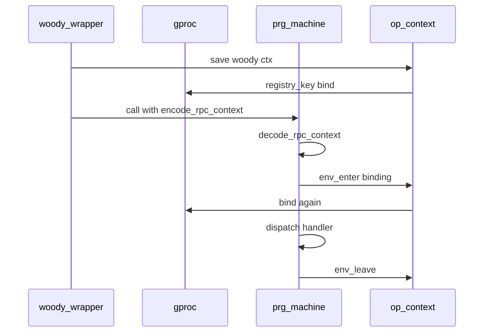
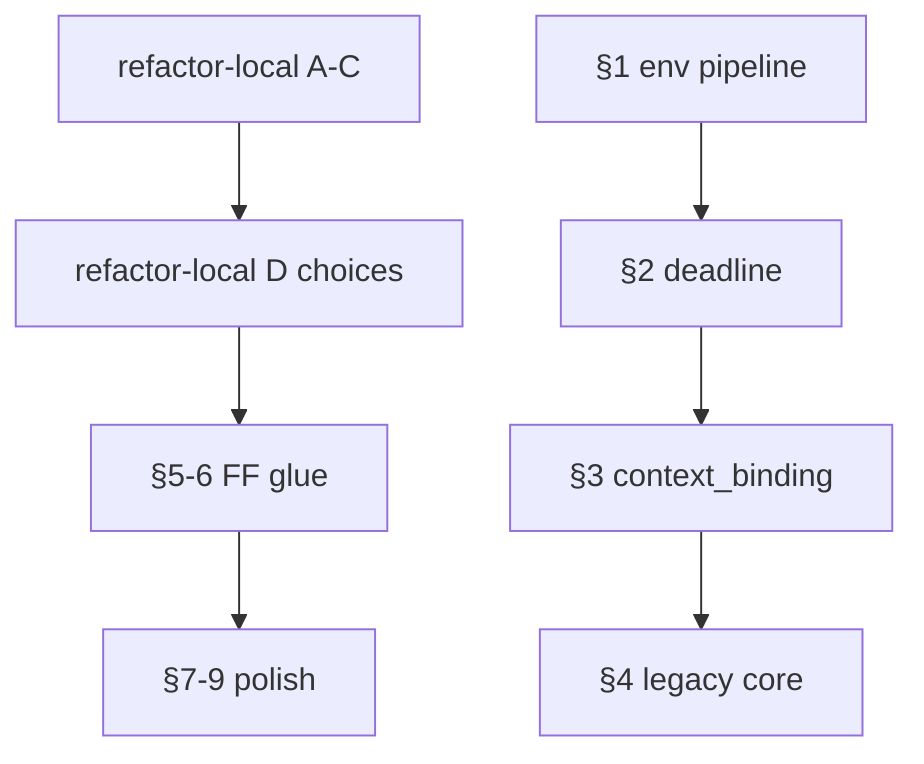

# Архитектурный рефакторинг `prg_machine`

Крупные задачи с изменением контрактов, несколькими apps или migration policy. Понятные локальные правки — в [refactor-local.md](refactor-local.md).

*Обновлено: 2026-06-17.*

---

## Принцип

| Критерий | Local file | Architecture file |
|----------|------------|-------------------|
| 1–2 файла, без смены контракта | ✓ | |
| Несколько apps / HTTP + worker | | ✓ |
| Migration / rollback policy | | ✓ |
| Нужен отдельный PR / итерация | | ✓ |

---

## 1. Env-scoping pipeline

**Приоритет:** HIGH

### Проблема

Woody-контекст проходит через gproc **дважды** на одном RPC:



### Файлы

- [`apps/op_context/src/op_context.erl`](../apps/op_context/src/op_context.erl) — `save/load`, `env_enter/env_leave`, `current_woody_context/0`
- [`apps/prg_machine/src/prg_machine.erl`](../apps/prg_machine/src/prg_machine.erl) — `encode_rpc_context/0`, `run_scoped/3`
- [`apps/hg_proto/src/hg_woody_service_wrapper.erl`](../apps/hg_proto/src/hg_woody_service_wrapper.erl), [`apps/ff_server/src/ff_woody_wrapper.erl`](../apps/ff_server/src/ff_woody_wrapper.erl)
- [`config/sys.config`](../config/sys.config) — `context_binding`

### Цель

Один источник truth для woody/party ctx в progressor worker: либо передавать decoded ctx явно в handler, либо `env_enter` только там, где handler читает `op_context:load/1`.

### Критерий готовности

- Нет двойного gproc bind на одном RPC
- HG CT + FF handler CT проходят с party client в repair/call

### Риски

- Регрессии в FF lenient vs HG strict `cleanup_mode`
- `current_woody_context/0` перебирает HG, потом FF — неявная связность

### Тесты

- `prg_machine` env mock tests
- `hg_invoice_tests_SUITE`, FF handler suites

---

## 2. Duplicate deadline

**Приоритет:** MEDIUM

### Проблема

Default handling timeout (30s) выставляется **дважды**:

1. HTTP-граница: `ensure_woody_deadline_set/2` в woody wrappers
2. Worker: `ensure_deadline_set/2` в `prg_machine:process/3`

### Файлы

- [`apps/prg_machine/src/prg_machine.erl`](../apps/prg_machine/src/prg_machine.erl) — `ensure_deadline_set/2`, opt `default_handling_timeout`
- [`apps/hg_proto/src/hg_woody_service_wrapper.erl`](../apps/hg_proto/src/hg_woody_service_wrapper.erl)
- [`apps/ff_server/src/ff_woody_wrapper.erl`](../apps/ff_server/src/ff_woody_wrapper.erl)

### Цель

Deadline только на HTTP-границе до `encode_rpc_context`; worker не переопределяет woody deadline без явной причины.

### Критерий готовности

- Единый helper или одна точка установки deadline
- CT с коротким/отсутствующим deadline не ломаются

### Риски

- Notify/async paths без woody wrapper

---

## 3. `context_binding` DRY

**Приоритет:** MEDIUM

### Проблема

Ключи gproc заданы в **двух местах**:

- [`config/sys.config`](../config/sys.config): `registry_key => {p, l, stored_hg_context}` (HG), FF-аналог
- [`apps/op_context/src/op_context.erl`](../apps/op_context/src/op_context.erl): `key/1`, `binding/1`

Расхождение сломает worker scoping незаметно.

### Цель

При старте HG/FF собирать progressor `options.context_binding` через `op_context:binding(hellgate | fistful)` — без hardcode literals в sys.config.

### Файлы

- `config/sys.config`, `test/*/sys.config`
- `apps/hellgate/src/hellgate.erl`, `apps/ff_server/src/ff_server.erl` — registry init

### Критерий готовности

- Один источник ключей gproc
- CT configs используют тот же механизм

---

## 4. Legacy migration из core runtime

**Приоритет:** MEDIUM

### Проблема

Политика совместимости с `hg_machine` / `ff_machine` зашита в permanent runtime:

| Механизм | Где | Суть |
|----------|-----|------|
| `{bin, Bin}` unwrap | `prg_machine:decode_term/1` | Legacy double envelope call args |
| Dual metadata keys | `event_metadata/1` | `format` + `format_version` |
| `initial_model/2` | `prg_machine:collapse/2` | HG aux_state `#{model => ...}` |

### Цель

- Migration adapter или behaviour callback (`initial_model/1`, `decode_call_args/1`)
- Core runtime без HG/FF-specific rollback

### Файлы

- [`apps/prg_machine/src/prg_machine.erl`](../apps/prg_machine/src/prg_machine.erl)
- Handler codecs: [`hg_invoice.erl`](../apps/hellgate/src/hg_invoice.erl), [`ff_machine_codec.erl`](../apps/ff_transfer/src/ff_machine_codec.erl)

### Критерий готовности

- Новые events/calls не пишут legacy формы
- Чтение старых данных покрыто тестами migration adapter

### Риски

- Prod history с legacy envelope — нельзя удалить unwrap без migration window

---

## 5. FF codec chain

**Приоритет:** MEDIUM (зависит от [refactor-local.md §D2](refactor-local.md#d2-ff-codec-chain))

### Проблема


- `ff_machine_codec` — **единственный** caller `ff_machine_lib` для marshal/unmarshal
- Behaviour callbacks в machines — 1 строка delegate

### Варианты

| ID | Стратегия |
|----|-----------|
| A | Merge `ff_machine_codec` → `ff_machine_lib` |
| B | Machines → `ff_machine_codec` напрямую, lib без passthrough |
| C | Status quo до отдельного PR |

### Цель

Убрать лишний hop без потери shared create/get/repair в lib.

### Файлы

- [`apps/ff_transfer/src/ff_machine_lib.erl`](../apps/ff_transfer/src/ff_machine_lib.erl)
- [`apps/ff_transfer/src/ff_machine_codec.erl`](../apps/ff_transfer/src/ff_machine_codec.erl)
- `apps/ff_transfer/src/ff_*_machine.erl` (5 modules)

### Критерий готовности

- Цепочка marshal event: machine → codec → domain (max 2 hops)
- Eunit codec tests green

---

## 6. FF repair glue

**Приоритет:** MEDIUM

### Проблема

Repair path: `*_machine:process_repair` → `ff_machine_lib:process_repair` → `ff_repair:apply_scenario`.

- `ff_repair:apply_scenario/3,4` — **единственный** внешний caller `ff_machine_lib`
- Конвертация `prg_machine:machine()` ↔ `ff_repair:machine()` split между lib и repair

### Цель

`ff_repair` принимает `prg_machine:machine()` (или один converter module); machines зовут `ff_repair` без lib-glue.

### Файлы

- [`apps/fistful/src/ff_repair.erl`](../apps/fistful/src/ff_repair.erl)
- [`apps/ff_transfer/src/ff_machine_lib.erl`](../apps/ff_transfer/src/ff_machine_lib.erl)
- 5 `*_machine.erl`

### Критерий готовности

- `process_repair/2` в machine — ≤5 строк
- FF repair CT (`ff_withdrawal_session_repair_SUITE`, `force_status_change_test`) green

### Связь с local

- [refactor-local.md §C1](refactor-local.md#c1-ff_repairto_prg_machine1) — inline `to_prg_machine/1` (первый шаг)

---

## 7. `prg_machine_registry` gen_server shell

**Приоритет:** LOW

### Проблема

[`prg_machine_registry.erl`](../apps/prg_machine/src/prg_machine_registry.erl) — gen_server с пустыми `handle_call/cast/info`; `lookup/1` — прямой ETS; поле `state.handlers` не читается.

### Цель

ETS init в `prg_machine` application start / supervisor; registry list handlers один раз при старте HG/FF.

### Callers `lookup/1`

- `prg_machine.erl` (get/process)
- `ff_machine_trace.erl` (если не перенесён — см. local §D3)

### Критерий готовности

- Нет gen_server без state semantics
- Registry lookup behaviour unchanged

---

## 8. `hg_context` facade

**Приоритет:** LOW–MEDIUM

### Проблема

После удаления [`hg_context.erl`](../apps/hellgate/src/hg_context.erl) HG модули зовут `op_context:key(hellgate)` напрямую. Блок **идентичный** `get_party_client/0` скопирован в:

- [`hg_party.erl`](../apps/hellgate/src/hg_party.erl)
- [`hg_payment_institution.erl`](../apps/hellgate/src/hg_payment_institution.erl)
- [`hg_invoice_payment.erl`](../apps/hellgate/src/hg_invoice_payment.erl)

### Цель

Тонкий `hg_context` facade:

```erlang
load/0, cleanup/0, get_party_client/0
```

поверх `op_context` — **не** дублировать runtime scoping из §1.

### Критерий готовности

- Один `get_party_client/0` в HG
- `op_context` остаётся shared для FF + `prg_machine` env binding

---

## 9. FF `init_result` / `to_prg_result` унификация

**Приоритет:** LOW

### Проблема

Несогласованный стиль в 5 `*_machine`:

- source/destination/session: `ff_machine_lib:init_result/3`
- withdrawal/deposit: inline `#{events, action, auxst}` в `init/2`
- `to_prg_result/1` — trivial map, 8 callers

### Цель

Единый стиль init/process_result (все через lib **или** все inline).

### Связь

Не блокирует §5–§6; косметика после codec/repair glue.

---

## Порядок итераций



**Рекомендация:**

1. Закрыть [refactor-local.md](refactor-local.md) блоки A–C
2. Решить развилки D → отдельные PR
3. §1 env — отдельная большая итерация (HG+FF)
4. §5–§6 FF — после выбора D2
5. §7–§9 — по желанию

---

## Что не включаем

- Изменения progressor upstream / wire `action()` contract
- Массовый рефактор FF domain (`ff_withdrawal`, routing, limiter)
- Routing app split (`hg_route_collector` и т.д.) — отдельная история ветки
