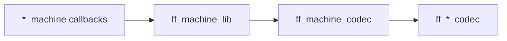

# Локальные упрощения после миграции на `prg_machine`

Понятные задачи с пошаговыми инструкциями. Крупные архитектурные изменения — в [refactor-architecture.md](refactor-architecture.md).

*Обновлено: 2026-06-17.*

---

## Уже сделано (не дублировать)

| Изменение | Где |
|-----------|-----|
| FF repairer `ComplexAction` → wire `action()` локально в codec | [`apps/ff_server/src/ff_codec.erl`](../apps/ff_server/src/ff_codec.erl) — `unmarshal_repairer_complex_action/2`, вызов из `unmarshal(complex_action, ...)` |
| Убраны мёртвые `prg_action:from_mg/1`, `schedule_after/1`, MG-хелперы | [`apps/prg_machine/src/prg_action.erl`](../apps/prg_machine/src/prg_action.erl) |
| Документация HG vs FF границ action | [`docs/prg-machine.md`](prg-machine.md) |

Policy для FF repairer (remove бьёт timer, unset → suspend) живёт в `ff_codec`, не в `prg_action`.

---

## Рекомендуемый порядок

1. [Блок A](#блок-a-мёртвый-код--dead-exports) — ~30 мин, низкий риск
2. [Блок B](#блок-b-hg--from_repair-локально-в-hg_invoice) — ~1 ч
3. [Блок C](#блок-c-ff--мелкий-inline-и-export-cleanup) — ~30 мин
4. [Блок D](#блок-d-развилки--не-делать-без-выбора) — выбрать стратегию, затем выполнить или перенести в architecture
5. [Блок E](#блок-e-проверка) — после каждого блока

---

## Блок A: мёртвый код / dead exports

**Риск:** низкий. **Развилок нет** (кроме последнего пункта — см. [Блок D](#блок-d-развилки--не-делать-без-выбора)).

### A1. `hg_invoice_payment:set_timer/2`

**Файл:** [`apps/hellgate/src/hg_invoice_payment.erl`](../apps/hellgate/src/hg_invoice_payment.erl)

**Проблема:** `set_timer/2` — обёртка с 1 caller; второй аргумент `_Action` не используется.

**Шаги:**

1. В `retry_session/3` (~2597) заменить:
   ```erlang
   NewAction = set_timer({timeout, Timeout}, Action),
   ```
   на:
   ```erlang
   NewAction = prg_action:schedule_timer({timeout, Timeout}),
   ```
2. Удалить `-spec set_timer/2` и функцию `set_timer/2` (~2655).

**Проверка:** `rebar3 compile`, HG CT по payment retry при необходимости.

---

### A2. `prg_machine:remove/2`, `emit_event/1`

**Файл:** [`apps/prg_machine/src/prg_machine.erl`](../apps/prg_machine/src/prg_machine.erl)

**Проблема:** 0 внешних callers. `remove` обрабатывается внутри `dispatch/4`; `emit_event/1` — alias к `emit_events/1`.

**Шаги:**

1. Убрать `remove/2` и `emit_event/1` из `-export`.
2. Функции оставить **internal** (используются внутри модуля / `ff_repair` зовёт `emit_events/1`).

**Не трогать:** `emit_events/1` — caller [`apps/fistful/src/ff_repair.erl`](../apps/fistful/src/ff_repair.erl).

---

### A3. `op_context:set_woody_context/2`

**Файл:** [`apps/op_context/src/op_context.erl`](../apps/op_context/src/op_context.erl)

**Проблема:** 0 callers.

**Шаги:**

1. Удалить из `-export`.
2. Удалить `-spec` и тело функции (~159–161).

---

### A4. `hg_invoicing_machine_client:thrift_call/8`

**Файл:** [`apps/hellgate/src/hg_invoicing_machine_client.erl`](../apps/hellgate/src/hg_invoicing_machine_client.erl)

**Проблема:** 8-arg версия с range не вызывается снаружи; 5-arg делегирует в 8-arg с `undefined, undefined, forward`.

**Минимальный fix (без развилки D1):**

1. Убрать `-export([thrift_call/8])`.
2. Оставить одну `thrift_call/5`, inline логику без делегирования в 8-arg.

**Полное решение:** см. [развилку D1](#d1-hg_invoicing_machine_client).

---

## Блок B: HG — `from_repair` локально в `hg_invoice`

**Риск:** средний. **Развилок нет.**

**Проблема:** `prg_action:from_repair/1` имеет **1 caller** — [`hg_invoice.erl:333`](../apps/hellgate/src/hg_invoice.erl). FF repair идёт через `ff_codec`, не через `prg_action`.

### B1. Перенести repair → wire в `hg_invoice`

**Источник логики:** [`apps/prg_machine/src/prg_action.erl`](../apps/prg_machine/src/prg_action.erl) — `from_repair/1`, `from_timer_remove/2`, `repair_timer_field/1`, `repair_remove_field/1`.

**Шаги:**

1. В [`hg_invoice.erl`](../apps/hellgate/src/hg_invoice.erl) добавить include `dmsl_repair_thrift.hrl` (если ещё нет).
2. Восстановить приватные функции (имена как на master до prg-миграции):
   - `construct_repair_action/1` — `#repair_ComplexAction{}` → wire `action()`
   - `merge_repair_action/2` — merge с текущим action при repair (если используется в ~333)
3. Policy (как сейчас в `prg_action`):
   - `remove` beats timer
   - `undefined + undefined` → `idle`
   - `{set_timer, Timer}` → `prg_action:schedule_timer(Timer)`
   - `unset_timer` → `suspend`
4. Заменить `prg_action:from_repair(RepairAction)` на локальный вызов.

### B2. Упростить `prg_action`

**Шаги:**

1. Удалить `-export([from_repair/1])`.
2. Удалить `from_repair/1`, `from_timer_remove/2`, `repair_timer_field/1`, `repair_remove_field/1`, типы `timer_field`/`remove_field`.
3. Убрать `-include_lib("damsel/include/dmsl_repair_thrift.hrl")`.
4. Обновить комментарий модуля: только scheduling helpers + `marshal_timer/1`.

**Оставить в `prg_action`:** `schedule_timer/1`, `schedule_deadline/1`, `marshal_timer/1`, типы `t/0`, `timer/0`, `seconds/0`.

### B3. Документация

В [`docs/prg-machine.md`](prg-machine.md) (~116) заменить упоминание `from_repair/1` на «damsel repair → wire в `hg_invoice`».

---

## Блок C: FF — мелкий inline и export cleanup

**Риск:** низкий. **Развилок нет.**

### C1. `ff_repair:to_prg_machine/1`

**Файл:** [`apps/fistful/src/ff_repair.erl`](../apps/fistful/src/ff_repair.erl)

**Проблема:** 1 внешний caller — [`ff_withdrawal_session_machine.erl`](../apps/ff_transfer/src/ff_withdrawal_session_machine.erl) (~169), processor `set_session_result`.

**Шаги (вариант inline в machine):**

1. В processor заменить `ff_repair:to_prg_machine(RMachine)` на inline map:
   ```erlang
   #{namespace := NS, id := ID, history := History, aux_state := AuxSt} = RMachine,
   Machine = #{namespace => NS, id => ID, history => ..., aux_state => AuxSt},
   ```
   (history уже в формате prg — см. `repair_history_to_prg/1` в `ff_repair`).
2. Удалить `-export([to_prg_machine/1])` и функцию из `ff_repair`.
3. Оставить **internal** `to_prg_machine/1` в `ff_repair`, если нужен для `validate_result/3`.

### C2. `ff_machine_lib` — убрать лишние exports

**Файл:** [`apps/ff_transfer/src/ff_machine_lib.erl`](../apps/ff_transfer/src/ff_machine_lib.erl)

**Проблема:** функции экспортированы, но **0 внешних callers** (только internal lib):

| Функция | Internal usage |
|---------|----------------|
| `to_repair_machine/1` | `process_repair/*` |
| `from_repair_result/2` | `process_repair/*` |
| `repair_events_to_domain/1` | `from_repair_result/2` |
| `event_body_from_timestamped/1` | `repair_events_to_domain/1`, `unmarshal_event_body/2` |
| `history_to_events/1` | `get/5` |
| `codec_timestamp/1` | `history_to_events/1` |

**Шаги:**

1. Убрать перечисленные функции из `-export`.
2. Функции и `-spec` оставить в модуле (private по умолчанию в Erlang).

**Не убирать из export:** `create/4`, `get/5`, `events/4`, `repair/3`, `process_repair/*`, `to_prg_result/1`, `init_result/*`, `machine_to_st/2`, `marshal_event_body/3`, `unmarshal_event_body/2`, `marshal_aux_state/1`, `unmarshal_aux_state/1`.

---

## Блок D: развилки — не делать без выбора

После выбора — дописать решение в этот файл или перенести в [refactor-architecture.md](refactor-architecture.md).

### D1. `hg_invoicing_machine_client`

**Файл:** [`apps/hellgate/src/hg_invoicing_machine_client.erl`](../apps/hellgate/src/hg_invoicing_machine_client.erl)

**Callers:** [`hg_invoice_handler.erl`](../apps/hellgate/src/hg_invoice_handler.erl), [`hg_invoice_template.erl`](../apps/hellgate/src/hg_invoice_template.erl).

| Вариант | Действие | Плюсы | Минусы |
|---------|----------|-------|--------|
| **A (рекомендуется)** | Удалить модуль; 5–10 строк `prg_machine:call` + `normalize_response/1` в handlers | Меньше hop, видно контракт call | Небольшое дублирование между handler и template |
| **B** | Оставить модуль, только A4 (убрать `thrift_call/8`) | Минимальный diff | Модуль остаётся thin pass-through |

**Snippet для варианта A (handler):**

```erlang
case prg_machine:call(NS, ID, {FunRef, Args}) of
    {ok, Response} -> normalize_call_response(Response);
    {error, notfound} -> {error, notfound};
    {error, failed} -> {error, failed};
    {error, _} = Error -> Error
end.
```

---

### D2. FF codec chain

**Цепочка:**



**Проблема:** `ff_machine_codec` вызывается **только** из `ff_machine_lib`; machines — только lib.

| Вариант | Действие | Когда выбирать |
|---------|----------|----------------|
| **A** | Слить `ff_machine_codec.erl` в `ff_machine_lib.erl` | Хочется один FF codec entry point |
| **B** | Machines зовут `ff_machine_codec` напрямую; lib теряет passthrough `marshal_*`/`unmarshal_*` | Хочется убрать lib hop, codec остаётся отдельным модулем |
| **C (рекомендуется при сомнении)** | Отложить | → [refactor-architecture.md §5](refactor-architecture.md#5-ff-codec-chain) |

---

### D3. `ff_machine_trace`

**Файлы:** [`apps/ff_transfer/src/ff_machine_trace.erl`](../apps/ff_transfer/src/ff_machine_trace.erl) — **1 caller** [`ff_machine_handler.erl`](../apps/ff_server/src/ff_machine_handler.erl).

| Вариант | Действие |
|---------|----------|
| **A (рекомендуется)** | Перенести модуль в `apps/ff_server/src/` (debug HTTP рядом с handler) |
| **B** | Оставить в `ff_transfer` |

**Замечание:** trace дублирует `decode_term/1` из `prg_machine` — при переносе рассмотреть экспорт decode helper из `prg_machine` (см. architecture §5).

---

## Блок E: проверка

После каждого блока:

```bash
rebar3 compile
rebar3 eunit --module=prg_action,ff_withdrawal_codec   # если трогали action/codec
```

При изменении HG invoice / client:

```bash
# smoke — конкретный suite по изменённой области
rebar3 ct --suite=apps/hellgate/test/hg_invoice_tests_SUITE
```

---

## Что сознательно не включено

- Массовый перенос FF domain logic — вне scope
- Изменения progressor dependency / wire `action()` contract
- Архитектурные задачи (env pipeline, deadline ×2, legacy в core) — [refactor-architecture.md](refactor-architecture.md)
